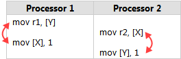

# Overall Features of C++
- REFERENCE variables and POINTER variables
- polymorphism: function overload and override
- Deterministic destruction of object
- Inheritance: virtual function
- Template
- Data structures and algorithms: STL
- Concurrency: threads, lock, lock free, wait free.

# Memory

## Memory layout of c++ program

### virtual function, virtual table

Reference:

- https://www.martinkysel.com/demystifying-virtual-tables-in-c-part-3-virtual-tables/

## Memory Management

### [RAII(Resource Acquisition is Initialization)](http://en.wikipedia.org/wiki/RAII)
Resource is hold only in the life cycle.

#### [Smart Pointers](https://en.wikipedia.org/wiki/Smart_pointer)
Smart pointers are RAII classes implemented with REFERENCE COUNTING.
Most of crash bugs are caused by referencing a destructed object.
1. Parent-child relation: avoid CIRCULAR REFERENCES of shared_ptr!
2. Pass smart pointers instead of raw pointers
3. For asynchronous/multi-threaded programs, pass smart pointers consistently.

Reference:
[shared_ptr](http://en.cppreference.com/w/cpp/memory/shared_ptr)
[weak_ptr](http://en.cppreference.com/w/cpp/memory/weak_ptr)

# assembly

## General-Purpose Registers (GPR) - 16-bit naming conventions
The 8 GPRs are:

```
Accumulator register (AX). Used in arithmetic operations
Counter register (CX). Used in shift/rotate instructions and loops.
Data register (DX). Used in arithmetic operations and I/O operations.
Base register (BX). Used as a pointer to data (located in segment register DS, when in segmented mode).
Stack Pointer register (SP). Pointer to the top of the stack.
Stack Base Pointer register (BP). Used to point to the base of the stack.
Source Index register (SI). Used as a pointer to a source in stream operations.
Destination Index register (DI). Used as a pointer to a destination in stream operations.
```

## Instruction Pointer
The EIP register contains the address of the next instruction to be executed if no branching is done.

EIP can only be read through the stack after a call instruction.

## SIMD
SIMD instructions use wide registers like `xmm0`, can be inspected with gdb `print $xmm0`.

# tools
`g++ -fdump-class-hierarchy -c a.cpp` can be used to generate layout of class.
Gdb `disassemble main` can be used to show assemble code of function.
Use gdb `info all-registers` can show all register values.

Reference: https://stackoverflow.com/questions/1632600/memory-layout-c-objects

# Concurrency & parallelism

## synchronization
- mutex: mutual exclusive
- semaphore: signal/wait mechanism, an integer whose value is never below zero.
  - named semaphore: system wide
  - unnamed semaphore: memory-bases semaphore. A binary semaphore can implement mutex.

## condition variable

consumer				producer
acquire LOCK
wait & release LOCK
						acquire LOCK
						produce data
						release LOCK
						notify
wake & acquire LOCK
consume data

Question: how to ensure wait is called before notify?
Answer: the LOCK is to ensure this with thread synchronization!

## Reader Writer Lock

Question: how to prevent starvation?

[Readers writers problem](https://en.wikipedia.org/wiki/Readers%E2%80%93writers_problem)
- Reader preference: writer starvation.
- Writer preference: readers starvation and low concurrency.
- Semaphore with FIFO queue: to avoid starvation!

c++17: https://en.cppreference.com/w/cpp/thread/shared_mutex

## Memory ordering
Memory ordering describes the order of accesses to computer memory by a CPU. The term can refer either to the memory ordering generated by the compiler during compile time, or to the memory ordering generated by a CPU during runtime.

Reference
- [memory ordering](https://en.wikipedia.org/wiki/Memory_ordering#cite_note-table-10)
- [std::memory_order](https://en.cppreference.com/w/cpp/atomic/memory_order)
- [gcc atomic sync](https://gcc.gnu.org/wiki/Atomic/GCCMM/AtomicSync)
- [Memory barriers are like source control operations](https://preshing.com/20120710/memory-barriers-are-like-source-control-operations/)
- [the purpose of memory order consume in cpp11](https://preshing.com/20140709/the-purpose-of-memory_order_consume-in-cpp11/)

Different memory order types:
- sequentially consistent: ensure happens-before, by default, may hurt performance
- relaxed: only ensure atomicity, used for counters such as shared_ptr
- release & acquire: all memory writes (non-atomic and relaxed atomic) that happened-before the atomic store from the point of view of thread A(store release), become visible side-effects in thread B (load acquire), used for mutual exclusion locks.
- release & consume: If an atomic store in thread A is tagged memory_order_release and an atomic load in thread B from the same variable is tagged memory_order_consume, all memory writes (non-atomic and relaxed atomic) that are dependency-ordered-before the atomic store from the point of view of thread A, become visible side-effects within those operations in thread B into which the load operation carries dependency.

To eliminate those reorderings
- Set thread affinities so that both worker threads run exclusively on the same CPU core
- Introduce a CPU BARRIER between the two instructions

[memory barrier](https://en.wikipedia.org/wiki/Memory_barrier)

A memory barrier, also known as a membar, memory fence or fence instruction, is a type of barrier instruction that causes a central processing unit (CPU) or compiler to enforce an ordering constraint on memory operations issued before and after the barrier instruction
Note that whether memory reorder happens depends on the hardware and compiler support, for example, ARM is weakly ordered CPU while x86 is strongly.




Reference
- [memory-barriers](https://www.kernel.org/doc/Documentation/memory-barriers.txt)

## Lock Free Programming


- CAS operation uses compare, so it suffers from  [ABA problem](https://en.wikipedia.org/wiki/ABA_problem).

Reference
- [An Introduction To Lock Free programming](https://preshing.com/20120612/an-introduction-to-lock-free-programming/)

# CPU architecture

## Strategy to improve throughput
- parallel/batch:
- pipeline

## [pipeline](https://en.wikipedia.org/wiki/Instruction_pipelining)

Problems:
- hazard caused pipeline stall. Out-of-order execution may solve this.

Reference:
- Computer systems: a programmer's perspective

# Operating System

## Context Switch

## Memory 

## Process & Thread

# Network

## Basic TCP/UDP

## Kernel Bypass

# Architecture & Design

- Architecture as a collection of Data Structures
- Use STATE MACHINE and DAG(directed acyclic graph), instead of nested callback functions!
	- Callback hell is evil!
	- Parse STATE/DATA, instead of using callback functions
- Synchronize data between threads using lock, signal, variables
- Encapsulate low-level resources as classes, and wrap objects with smart pointers to manage the resource releasing automatically

## Implement getter and setter methods, if properties are from member objects, not member variables
1. Subclasses inheriting the base class can capture the member property change event
2. The member property is dynamic

## Thread safety, thread synchronization
1. State with lock 
2. Use RAII. In multi-threaded scenario, an asynchronous thread referencing an object that may be destroyed by another thread.
Solution:
- Use shared_ptr as strong reference to that object in the asynchronous thread, and the destroying thread never manually release resources, just decrease its reference.
- Use weak_ptr to check whether it has expired. Still, the resource is managed with its life span. Used to resolve cyclical reference, such as in observer pattern.


# [Design Patterns](https://en.wikipedia.org/wiki/Software_design_pattern)
- Creational patterns
	- Singleton: Ensure a class has only one instance, and provide a global point of access to it.
	- Resource acquisition is initialization (RAII): Ensure that resources are properly released by tying them to the lifespan of suitable objects
	- Object pool: Avoid expensive acquisition and release of resources by recycling objects that are no longer in use. Can be considered a generalisation of connection pool and thread pool patterns.
	- Abstract factory: Provide an interface for creating families of related or dependent objects without specifying their concrete classes.
- Structural patterns
	- Decorator: Attach additional responsibilities to an object dynamically keeping the same interface. Decorators provide a flexible alternative to subclassing for extending functionality.
- Behavioural patterns
	- State: Allow an object to alter its behavior when its internal state changes. The object will appear to change its class.
	- Iterator: Provide a way to access the elements of an aggregate object sequentially without exposing its underlying representation.
	- Observer: Define a one-to-many dependency between objects where a state change in one object results in all its dependents being notified and updated automatically.
	- Null object: Avoid null references by providing a default object.
- Concurrency patterns
	- Lock: One thread puts a "lock" on a resource, preventing other threads from accessing or modifying it.
	- Thread pool: A number of threads are created to perform a number of tasks, which are usually organized in a queue. Typically, there are many more tasks than threads. Can be considered a special case of the object pool pattern.
	- Thread-specific storage: Static or "global" memory local to a thread.
	- Monitor object: An object whose methods are subject to mutual exclusion, thus preventing multiple objects from erroneously trying to use it at the same time.


# Common bugs
1. Most of crashes are due to wrong/NULL pointers
2. NULL pointers appear when not initialized, sub-routines return NULL, objects destructed early!
3. Jittering problem
Memory unstable: occupied with other data! This is likely due to objects are
destructed early, watch the life cycle of objects!
4. For NUMERICAL computation programs, pay attention to MEMORY allocation and input DATA FORMAT!
5. Use make_shared when constructing objects for shared_ptr to improve performance by using a single dynamic memory allocation.

```c++
// weak_ptr::expired example
#include <iostream>
#include <memory>

int main () {
  std::shared_ptr<int> shared (new int(10));
  std::weak_ptr<int> weak(shared);

  std::cout << "1. weak " << (weak.expired()?"is":"is not") << " expired\n";

  shared.reset();

  std::cout << "2. weak " << (weak.expired()?"is":"is not") << " expired\n";

  return 0;
}
```

### C++ STL & Coding tricks

STL containers will take care of elements' release automatically, but not allocated memory

#### vector
`vector` grows capacity in a EXPONENTIAL rate, and its amortized time complexity is 
`O(N)` when inserting N objects one by one.

#### map
map `operator[](key)` is not THREAD SAFE, when if key doesn't exist in the 
underlying red-black tree yet, because in this case, the red-black tree 
must be MODIFIED to insert such `key`.
Solutions include: use lock to synchronize, assign `(key, value)` before the 
critical section.


#### Macros

```cpp
#define DEBUG_NEW new(__FILE__, __LINE__)
#define new DEBUG_NEW

#### lock free & wait free
https://en.wikipedia.org/wiki/Non-blocking_algorithm
```

### Performance

#### Notation & Terminology
- QPS: query per second
- TPS (transactions per second): the number of transactions executed per second. In other words, it can be calculated based on how many transactions are executed over a certain duration of the test and then calculate it for a second. It's a rate of transactions w.r.t. time, it is also called as throughput
- RT: response time

#### TPS, concurrency, RT
There are two types of bound: I/O bound, CPU bound.

I/O bound:
```
TPS = (memory / worker memory)  * (1 / Task time)
```

CPU bound:
```
TPS = Num. cores * (1 /Task time)
```
,which is similar to Little's Law:
$$
Average number of users in the system = average response time * throughput
N  =  T  *  X
$$

where, $N = Number of users, T = RT (average response time), X = TPS$

#### Optimization

- cache usage: adherence 
- parallel: loop unrolling, SMID, gpu

### interview questions
- underlying of virtual method table
- `vector` resize algorithm(may cause iterator invalid)
- `map<float>` comparing equality function
- what happens when allocating a very large block of memory


### practial libraries
- google test
- computation graph libraries
  - cpp-taskflow(https://github.com/cpp-taskflow/cpp-taskflow)
  - openmp task(pragma implementation), only for static dependency
  - tbb flow graph(https://www.threadingbuildingblocks.org/tutorial-intel-tbb-flow-graph)

